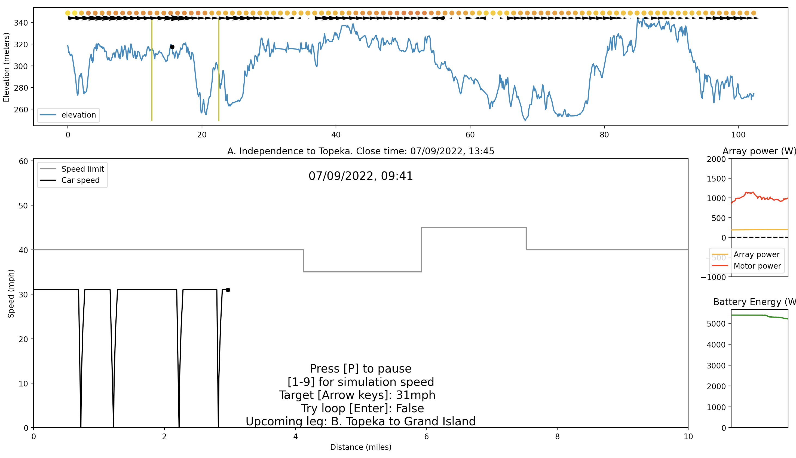
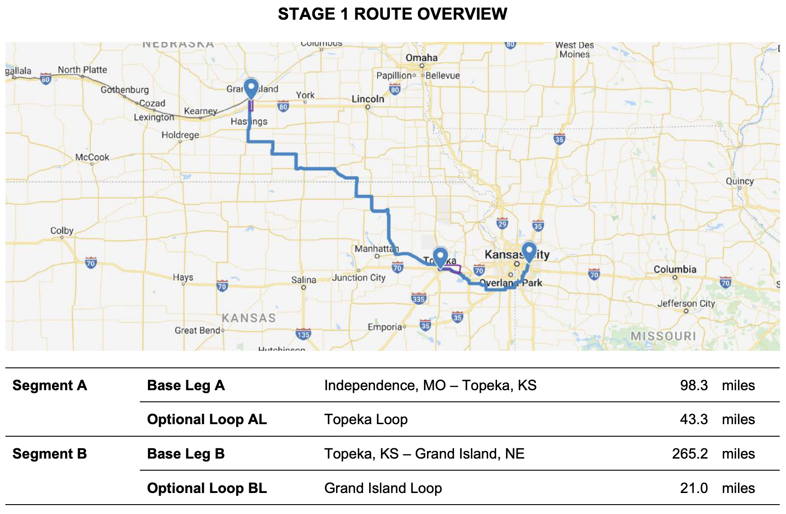

Welcome to strategy onboarding! One of the main projects is to create a driving plan for a simulated race based on Stage 1 of the [2022 American Solar Challenge](https://www.americansolarchallenge.org/the-competition/2022-american-solar-challenge/). It's totally fine if you can't code yet, you can try to make these race decisions in the GUI version with keyboard controls, and slowly work towards automating your manual decisions. Advanced programmers can use the headless version to quickly simulate many races to run optimization algorithms. This repository also contains some data from the 2022 race to [analyze](https://github.com/IlliniSolarCar/strategy-onboarding22/blob/main/analysis/analysis_fsgp2022_1.ipynb) as a separate project.

# How to get started:
* Install [VS Code](https://code.visualstudio.com/)
* Install [Python3](https://www.python.org/downloads/)
* Install [Git](https://git-scm.com/downloads)
* In a terminal/commandline, change directory to where you want to store this project
* Run in terminal: `git clone https://github.com/IlliniSolarCar/strategy-onboarding22`
* Open the strategy-onboarding22 folder in VS code, and open a terminal in the strategy-onboarding22 folder
* Create a virtual environment by running in terminal: `python3 -m venv .venv`
  * Should create a folder named ".venv"
  * If there is a VS Code popup asking whether you want to enable/activate the virtual environment, click yes.
* On mac, run `source .venv/bin/activate`. On windows, run `.venv/Scripts/activate.bat`
* There should be "(.venv)" before all commands in the terminal.
  * If not, try restarting VS Code or the terminal.
* Run in terminal: `pip3 install -r requirements.txt`
  * This installs modules like numpy, scipy, matplotlib that we depend on
* Try running `sim.py` 
  * Click on the file in the side bar to open, and then click the play button [ ▶️ ] in the upper right, or run in terminal: `python simulator/sim.py`
  * Click yes if prompted to install python extensions
  * After installing extensions, select the python intepreter to be '.venv' by clicking on Python version in the lower right corner of VS Code.
  * A window filled with graphs should pop up. Press [P] on your keyboard to play the simulation.


# Goal:
Running `sim.py` successfully will print out results containing the number of miles earned and the energy left. According to the American Solar Challenge (ASC) regulations, the team who earns the most miles wins. There are 4 stages to ASC 2022, so finishing a stage with extra energy left is desireable. The goal for this simulation of ASC 2022 Stage 1 is to earn as many miles as possible for Stage 1, and the tiebreaker will be the amount of energy left in the battery at the end.

This is what the [routebook](https://www.americansolarchallenge.org/ASC/wp-content/uploads/2022/06/ASC-2022-Route-Book.pdf) tells us:



There are 2 base legs and 2 optional loops.

Independence -> Topeka (+loop) -> Grand Island (+loop)

Schedule:
* Cars are released from Independence at 9:00.
* Teams should arrive at Topeka between 11:15pm and 13:45. At Topeka, they must stop and charge for 45 minutes, then choose whether to do the Topeka Loop. If the car arrives later than 13:45, it doesn't have to wait 45 minutes and should continue on to Grand Island.
* If the team tries the loop, they must finish the loop by 14:00. After finishing the loop, they may leave Topeka if it's later than 13:45, or attempt another loop after waiting 15 minutes.
* Teams who don't try the loop may leave Topeka at 13:45.
* Teams stop driving where they are at 18:00. Cars charge until 20:00. The next day (7/10), cars charge from 7:00 to 9:00, then can start driving again towards Grand Island.
* Cars should arrive at Grand Island between 9:00 and 18:00 on 7/10. When they arrive, cars stop and charge for 45 minutes, then choose whether to do the Grand Island Loop. If a car doesn't arrive by 18:00, they are considered trailered and drop to last place :(
* If the team tries the loop, they must finish the loop by 18:00. After finishing the loop, they may attempt another loop after waiting 15 minutes.

# Adding Strategies
* You have a couple options for this. To set speeds in the environment, you can use env.set_target_mph(new_speed), and to set acceleration/deceleration, use set_acceleration(acc)/set_deceleration(acc). For this, you are fine modifying the while loop inside of sim.py
* If you would like to use a more complex strategy, you can define it in the strategy class (strategies.py). sim_cli.py currently supports this. We have already implemented some strategies, including RandomStrategy(Choose a random number), LazyStrategy(Choose a single speed for entire race), and HardcodedStrategies(Choose speed based on CSV file). Every strategy needs to be a nested class inside of the  strategy superclass. You need the following three things.
* 1) an __init__ method that lets the user initialize the class. This will change depending on what default information is needed
* 2) a get_speed_with_parameters(self, parameters, environment) method with parameters as a dictionary with any values (could be None), and an environment object (which is a raceEnv object)
* 3) You need to register it as part of the init method in the strategy superclass.
      You can do that like this:
      ```python
      if self.strategy_name == 'my_strategy':
         self.strategy = self.MyStrategy(my_default_speed=13, my_default_accel=12)
      ```
* You need to change my_default_speed and  my_default_accel to whatever is needed to initialize your specific strategy
*  Each strategy must also contain a dictionary of the default parameters. You can copy and paste our examples (inside of the strategies folder for example 'strategies/lazy_default.json'). The important thing is that the configuration file contains the name of the strategy that matches up with the __init__() method in the strategy superclass. Please make sure if you create your own strategy that you add a default configuration.

## Hardcoded Strategy:
* The simplest way to code a complex strategy that requires no coding knowledge is to use HardcodedStrategy. This is a csv file that looks like this:
```csv
leg, distance, target_speed
A,   10,       30
A,   14,       25
A,   45,       20
AL1,  5,       40
AL2,  10,      30
B,    0,       30
```
* This means that once we reach a certain distance into a leg the target speed turns into what you set it too. If a leg is not specified or it is before the distance is reached, then it defaults to a target speed.
* You also need to change the config files (for example strategies/hardcoded_default.json) csv_file_name parameter to match the csv file you want.
* Run it with the following command: `python simulator/sim_cli.py -sf strategies/hardcoded_default.json`


# Common problems:
* pip install failed: You may be using an older version of this repository. Try running `git pull`.
* module not found: Didn't activate virtual environment, or virtual environment not installed in the correct place. Or python interpreter wasn't selected to be '.venv'.
* most random errors: Copy paste the error into Google and hope someone posted about the same problem somewhere :(

